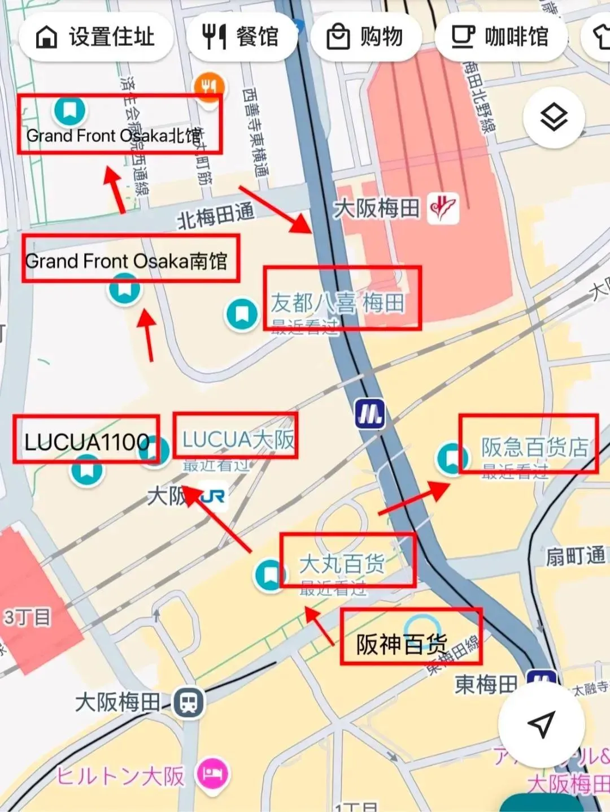
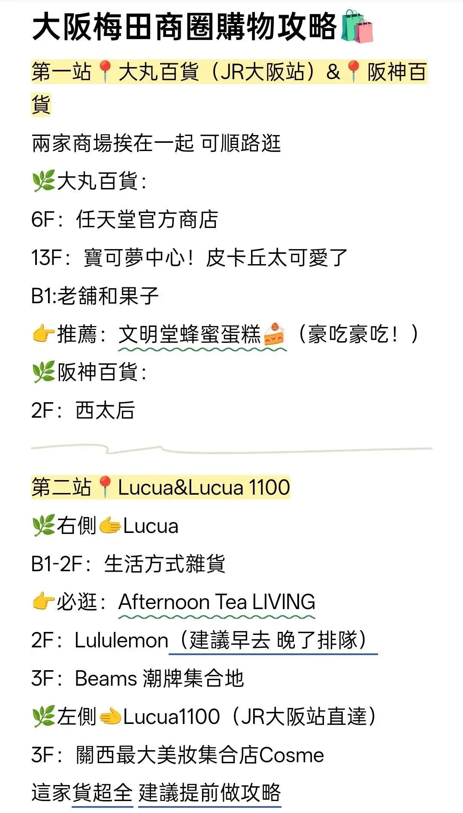
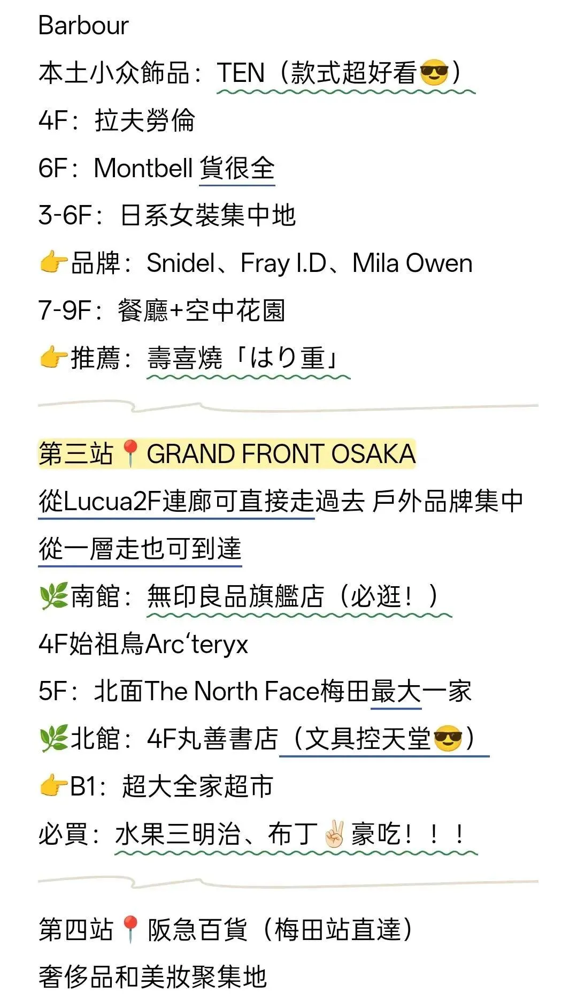
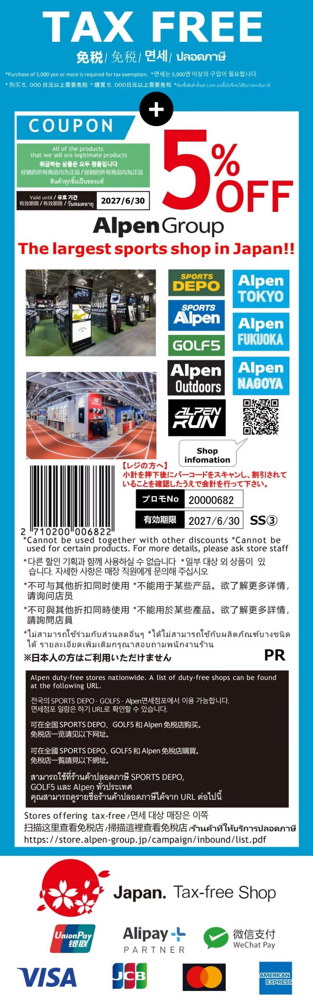
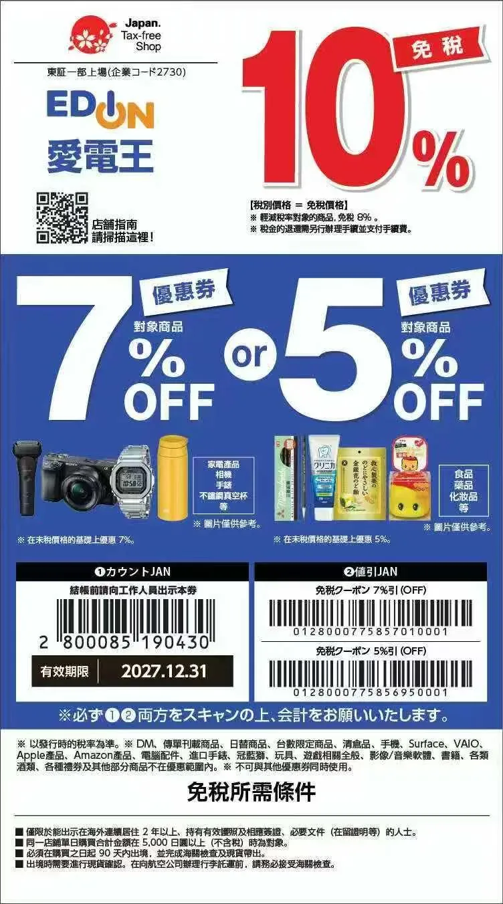
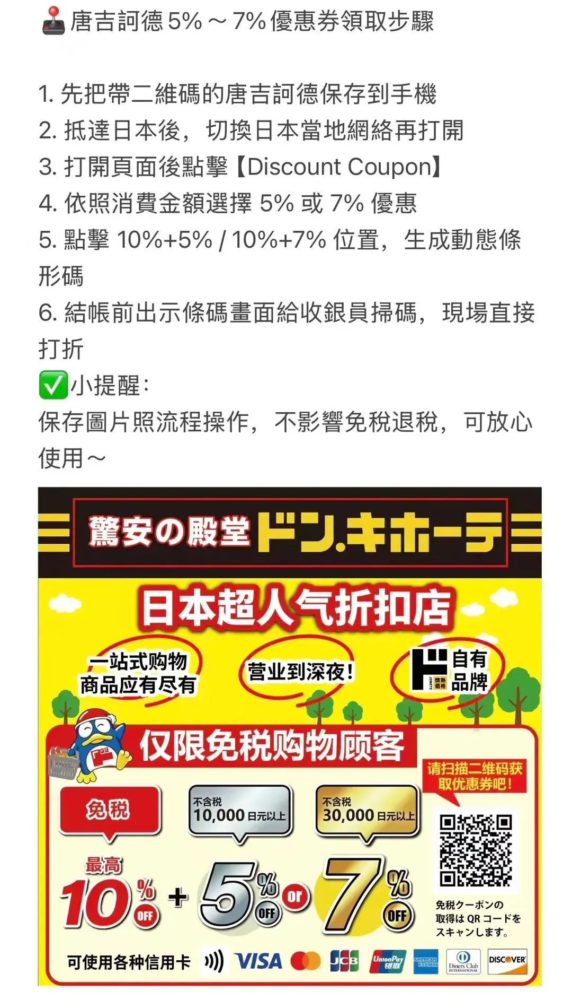
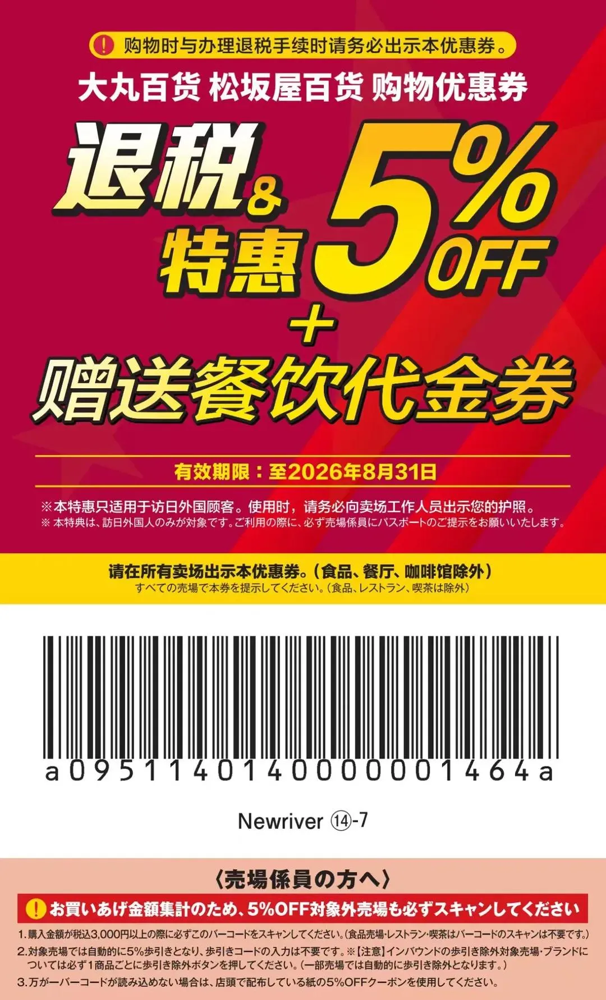
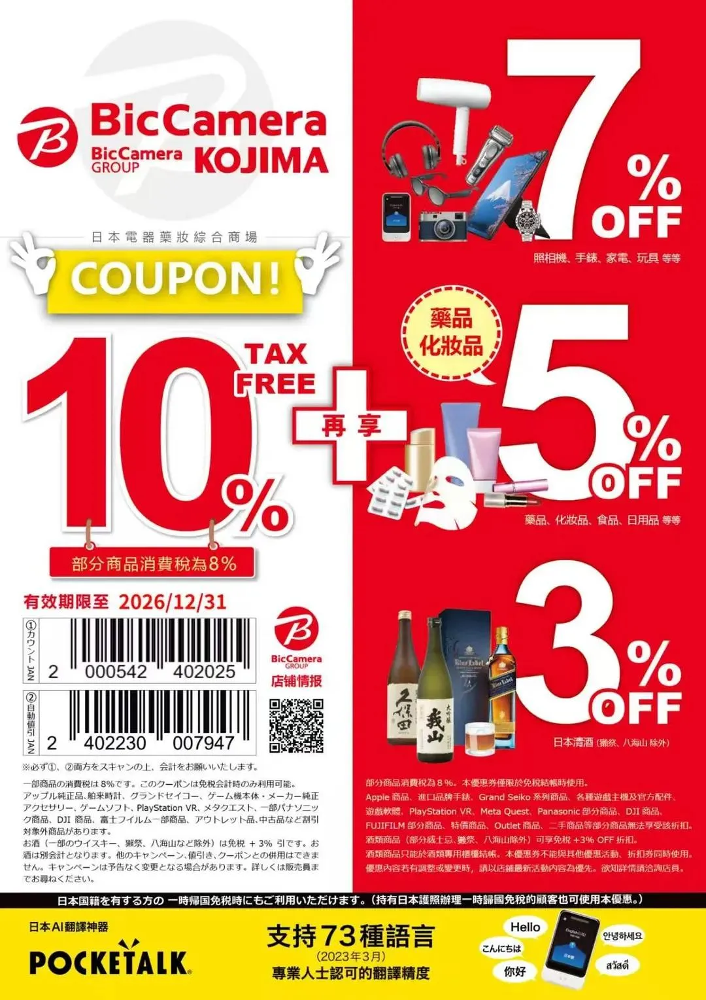
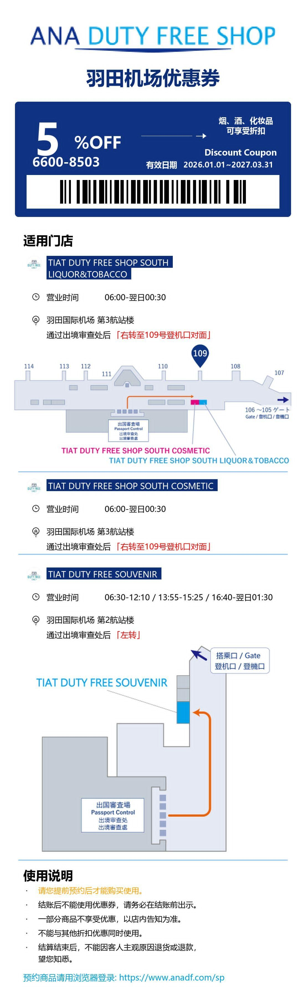
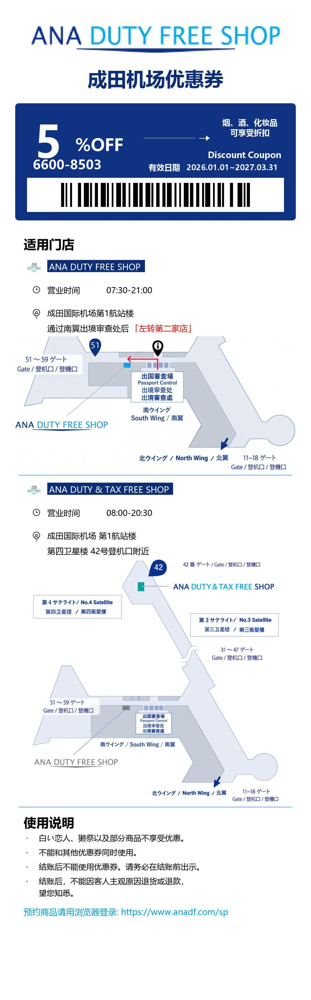

日本旅遊

大阪梅田商圈購物攻略🛍️（精簡版） 這是我連逛三天梅田商圈 總結出的購物攻略！！ 雙手奉上我的備忘錄📝

⚠️一天根本逛不完 首選大家感興趣的商場哦 購物用到的優惠券一起放在5-6-7-8-9了 祝大家購物愉快✌🏻✌🏻✌🏻  Translate

## 大阪梅田商圈購物攻略

### 商圈地圖

梅田商圈各大商場位置一覽：

- **Grand Front Osaka 北館 / 南館**
- **友都八喜 梅田**
- **LUCUA 1100 / LUCUA 大阪**
- **阪急百貨店**
- **大丸百貨**
- **阪神百貨**

### 第一站：大丸百貨（JR大阪站）＆ 阪神百貨

兩家商場挨在一起，可順路逛。

**大丸百貨：**
- 6F：任天堂官方商店
- 13F：寶可夢中心
- B1：老舖和菓子（推薦：文明堂蜂蜜蛋糕）

**阪神百貨：**
- 2F：西太后

### 第二站：Lucua ＆ Lucua 1100

**右側 Lucua：**
- B1-2F：生活方式雜貨（必逛：Afternoon Tea LIVING）
- 2F：Lululemon（建議早去，晚了排隊）
- 3F：Beams 潮牌集合地

**左側 Lucua 1100（JR大阪站直達）：**
- 3F：關西最大美妝集合店 Cosme（貨超全，建議提前做攻略）

**其他樓層：**
- Barbour、本土小眾飾品 TEN（4F，款式超好看）
- 4F：拉夫勞倫
- 6F：Montbell（貨很全）
- 3-6F：日系女裝集中地（Snidel、Fray I.D、Mila Owen）
- 7-9F：餐廳 + 空中花園（推薦：壽喜燒「はり重」）

### 第三站：Grand Front Osaka

從 Lucua 2F 連廊可直接走過去，戶外品牌集中，從一層走也可到達。

**南館：**
- 無印良品旗艦店（必逛！）
- 4F：始祖鳥 Arc'teryx
- 5F：北面 The North Face（梅田最大一家）

**北館：**
- 4F：丸善書店（文具控天堂）
- B1：超大全家超市（必買：水果三明治、布丁）

### 第四站：阪急百貨（梅田站直達）

奢侈品和美妝聚集地。

- 美妝區：1F 國際大牌、2F 日系專櫃（必逛：SUQQU、ADDICTION、Three）
- 女裝 3-5F：輕奢到高端（推薦：45R、川久保玲、MHL）
- 男士館：獨立一棟樓！
- B1 食品街：
  - 芝士工房 KANAE：流心芝士蛋糕
  - 然花抄院：抹茶卷天花板
  - Frantz：草莓松露巧克力

### 第五站：友都八喜 Yodobashi

電子產品 + 各類玩具，閉店時間較晚，可放在最後逛。

---

## 優惠券合集

⚠️ 購物用到的優惠券一起放在下面了，祝大家購物愉快！

### Alpen Group｜免稅 + 5% OFF

日本最大運動用品店，旗下品牌包括 SPORTS DEPO、Alpen、GOLF5、Alpen Outdoors、Alpen RUN、Alpen TOKYO、Alpen FUKUOKA、Alpen NAGOYA。

- 有效期限：至 2027/6/30
- 支持支付方式：UnionPay 銀聯、Alipay、微信支付、VISA、JCB、Mastercard、American Express

> 購買 5,000 日圓以上可免稅，不可與其他折扣同時使用。

### 唐吉訶德（驚安の殿堂ドン・キホーテ）｜5% ~ 7% OFF

**領取步驟：**
1. 先把帶二維碼的唐吉訶德保存到手機
2. 抵達日本後，切換日本當地網路再打開
3. 打開頁面後點擊【Discount Coupon】
4. 依照消費金額選擇 5% 或 7% 優惠
5. 點擊 10%+5% / 10%+7% 位置，生成動態條形碼
6. 結帳前出示條碼畫面給收銀員掃碼，現場直接打折

> 小提醒：保存圖片照流程操作，不影響免稅退稅，可放心使用。

### 大丸百貨・松坂屋百貨｜退稅 ＆ 5% OFF + 贈送餐飲代金券

- 有效期限：至 2026 年 8 月 31 日
- 僅適用於訪日外國顧客，使用時請務必出示護照
- 請在所有賣場出示本優惠券（食品、餐廳、咖啡館除外）

### EDION 愛電王｜10% 免稅 + 7% / 5% OFF

- 免稅 10%（部分商品消費稅為 8%）
- 家電產品、相機、手錶、不鏽鋼真空杯等：優惠 7%
- 食品、藥品、化妝品等：優惠 5%
- 有效期限：至 2027.12.31

> 結帳前請向工作人員出示本券，須同時掃描兩個條碼。

### BicCamera・KOJIMA｜10% 免稅 + 再享折扣

- 免稅 10%（部分商品消費稅為 8%）
- 相機、手錶、家電、玩具等：再享 7% OFF
- 藥品、化妝品、食品、日用品等：再享 5% OFF
- 日本清酒（獺祭、八海山除外）：再享 3% OFF
- 有效期限：至 2026/12/31

> 須同時掃描①②兩個條碼，部分商品（Apple、遊戲主機、Panasonic、Dyson 等）不適用。

### ANA DUTY FREE SHOP 羽田機場｜5% OFF

- 優惠碼：6600-8503
- 有效日期：2026.01.01 ~ 2027.03.31
- 適用門店：
  - TIAT DUTY FREE SHOP SOUTH LIQUOR & TOBACCO（第 3 航廈，06:00-翌日 00:30）
  - TIAT DUTY FREE SHOP SOUTH COSMETIC（第 3 航廈，06:00-翌日 00:30）
  - TIAT DUTY FREE SOUVENIR（第 2 航廈，06:30-12:10 / 13:55-15:25 / 16:40-翌日 01:30）

> 須在結帳前出示，不能與其他折扣優惠同時使用，部分商品（白い恋人、獺祭等）不享受優惠。

### ANA DUTY FREE SHOP 成田機場｜5% OFF

- 優惠碼：6600-8503
- 有效日期：2026.01.01 ~ 2027.03.31
- 適用門店：
  - ANA DUTY FREE SHOP（成田國際機場第 1 航廈，07:30-21:00）
  - ANA DUTY & TAX FREE SHOP（成田國際機場第 1 航廈，08:00-20:30）

> 須在結帳前出示，不能與其他折扣優惠同時使用。

---
